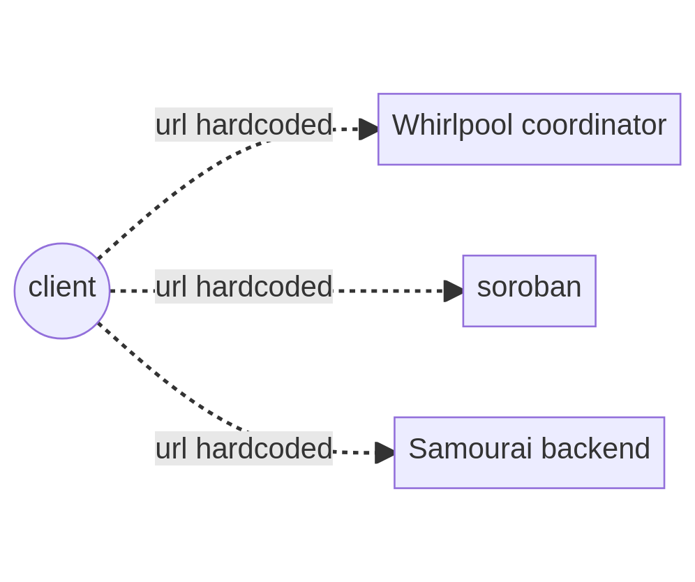

# DECENTRALIZING SAMOURAI

## I. Current architecture

### 1. Overview
- URLs are hardcoded into Java librairies
- single server per service

### 2. Current Whirlpool architecture
- 1 coordinator instance
    * using a MySQL server (to store banned clients, mix history, postmix address reuse...)
    * using a bitcoin node
- coordinator URL is hardcoded into client: `pool.whirl.mx`

Main issues:
- censorship: slow to recover if pool.whirl.mx were blacklisted (would require updating all clients with new hardcoded address)
- DDOS: single coordinator is an easy target
- scaling: coordinator is handling growing whirlpool traffic (900+ websocket connexions)
- mixing downtimes during coordinator upgrades

Constraints for upgrading current architecture:
- coordinator side:
    * coordinator requires a centralized MYSQL database (for storing mix history, banned users, postmix address-reuse...)
- client side: 
    * keep changes as small as possible for client to make upgrade easier for whirlpool partners
    * keep current mixing protocol unchanged

## II. Decentralizing Whirlpool
See [README-whirlpool.md](README-whirlpool.md)

## III. Decentralizing Soroban
TODO

## IV. Decentralizing Samourai backend
TODO