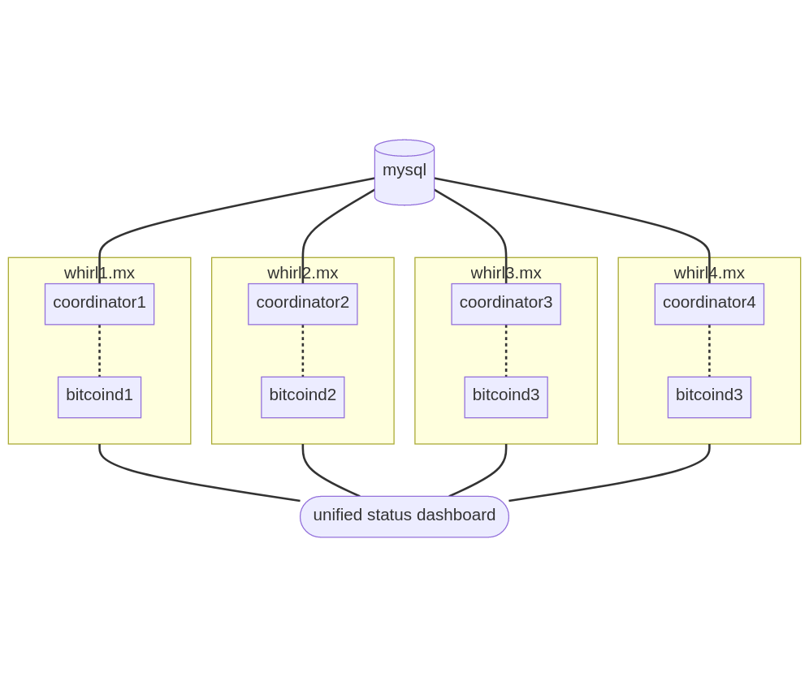

# COORDINATOR DECENTRALIZATION

## I. Current architecture
### 1. Overview

- 1 coordinator instance
    * using a MySQL server
    * using a bitcoin node
- coordinator URL is hardcoded into client

### 2. Current architecture issues
- censorship: slow to recover if pool.whirl.mx were blacklisted (would require updating all clients with new hardcoded address)
- DDOS: single coordinator instance handles all whirlpool traffic, it's an easy target

### 3. Upgrade constraints
Constraints for upgrading current architecture:
- client side: 
    * keep changes as small as possible for client to make upgrade easier for whirlpool partners
    * keep current mixing protocol unchanged
    * ideally upgrade would be almost transparent to client  
- coordinator side:
    * all coordinator instances should share a centralized MYSQL database (for storing mix history, banned users, postmix address-reuse...)

    
## II. Proposal

### 1. Coordinator side

- multiple coordinator instances can be launched
- each intance has its own url clearnet + onion
- instances connect to a shared mysql database

### 2. Pools repartition

- each mixing pool is assigned to one instance
- each instance can manage [0-N] pools
    * if only one instance up, it's managing every pools
    * if there are more instances than pools, additional instances will stay online but with no pool assigned. It will wait for being assigned to a pool when an active instance is going down.

- a pool is managed by only one instance at a time:
    * all liquidities of a same pool are connected to the same instance
    
- when an instance gets offline, unassigned pools are assigned to active instances
    * mixing clients will be disconnected and reconnect to the new instance
    * instances can be synchronized through the shared MySQL database

### 3. Client side
- client has an hardcoded bootstrap node list to fetch active instances at startup
- client connects to a random instance and starts mixing as usual
- if instance is not assigned to client's mixing pool, it automatically gets redirected to the good one
- upgrade is almost 100% transparent to the client. It only has to handle instance redirection.

